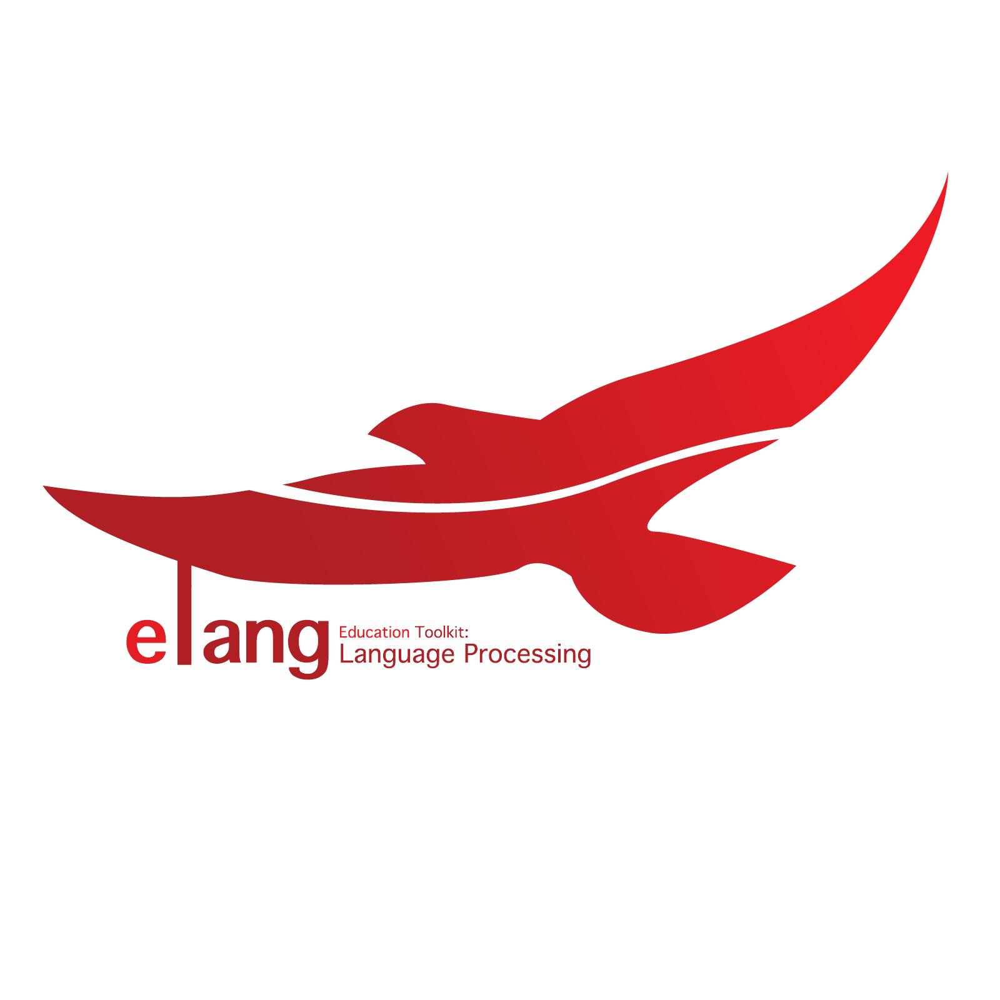

# Education Toolkit for Bahasa Indonesia NLP

Elang is an acronym that combines the phrases **Education (E)** and **Language Understanding (Lang)**. It is an education toolkit to demonstrate the ideas behind many Natural Language Processing strategies commercially used today. 

## Elang
Elang also means "eagle" in Bahasa Indonesia, and the _elang Jawa_ (Javan hawk-eagle) is the national bird of Indonesia, more commonly referred to as Garuda. 

